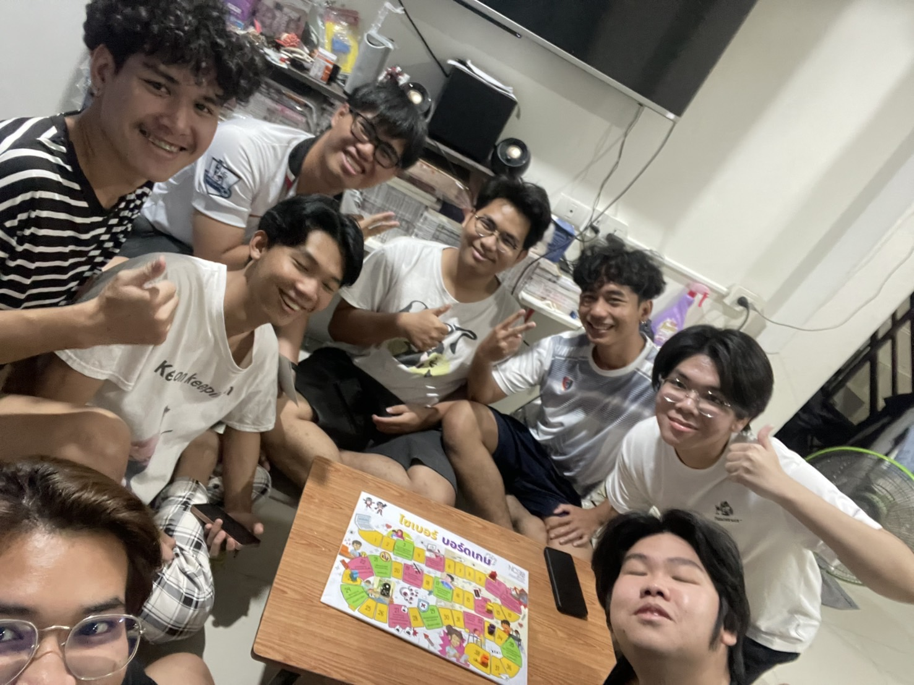
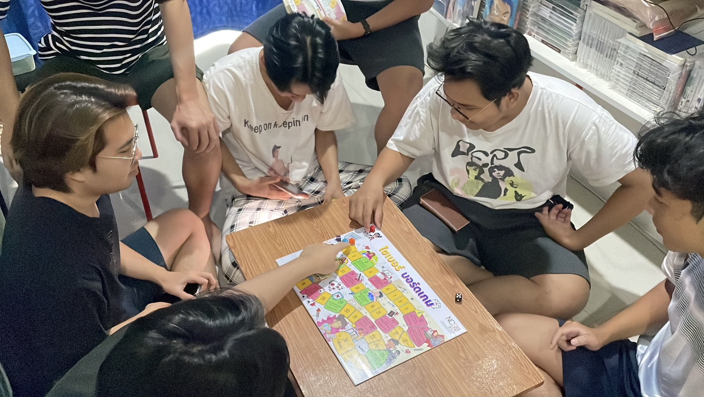
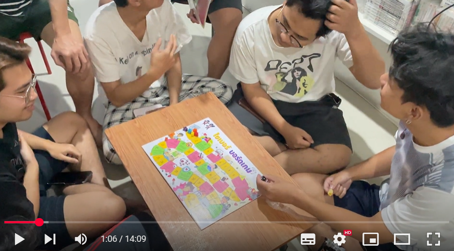

# Cyber Board Game By NOVA888 

## บรรยากาศภายในการทำกิจกรรมการเล่นบอร์ดเกมของสำนักงานคณะกรรมการการรักษาความมั่นคงปลอดภัยไซเบอร์แห่งชาติ(สกมช. หรือ NCSA)
**กิจกรรมการเล่นบอร์ดเกมครั้งนี้ เพื่อนๆ จากคณะวิทยาศาสตร์เข้าร่วมกันอย่างสนุกสนาน บอร์ดเกมถูกออกแบบมาให้มีความรู้เกี่ยวกับ ความปลอดภัยในโลก Cyber แทรกความรู้ไว้อยู่ในช่องพิเศษระหว่างเดินกระดาน**

**เเละเเชร์ความรู้พื้นฐานเกี่ยวกับ Cyber เพื่อให้เพื่อนๆได้ความรู้ไปใช้จริงในชีวิตประจำวัน**

**บรรยากาศในงานสนุกสนานและเป็นกันเอง**

## วันที่ทำกิจกรรม
**วันอังคาร ที่ 21 มกราคม พ.ศ. 2568 ณ หมู่บ้านเซนสิริโฮม แหลมฉบัง (อ่าวอุดม)**

## รายละเอียดกิจกรรม
- **กิจกรรมนี้เป็นกิจกรรมที่จัดโดยกลุ่ม "NOVA888" เป็นนิสิต คณะวิทยาศาสตร์ ศรีราชา สาขาวิทยาการคอมพิวเตอร์**

- **กิจกรรมนี้เป็นการเล่นบอร์ดเกมของสำนักงานคณะกรรมการการรักษาความมั่นคงปลอดภัยไซเบอร์แห่งชาติ(สกมช. หรือ NCSA)**

- **ซึ่งตัวบอร์ดเกมนี้มีชื่อว่า "ไซเบอร์ บอร์ดเกม" ในตัวกระดานนั้นในบางช่องก็จะมีอุปสรรคหรือบางช่องก็จะมีตัวช่วยต่างๆอยู่ แต่ละอันจะมีเนื้อหา คำแนะนำเกี่ยวกับโลกออนไลน์หรือความปลอดภัยหรือการใช้อุปกรณ์อิเล็กทรอนิกส์แฝงอยู่ด้วยแฝงอยู่ด้วย**

- **ในส่วนของวิธีการเล่นนั้นจะเล่นคล้ายๆเกมบันไดงูก็คือ จะมีการทอยลูกเต๋าแล้วก็เดินไปตามช่องตามหน้าลูกเต๋าที่ออก ใครถึงเส้นชัยก่อนชนะ แต่การจะถึงเส้นชัยนั้นก็จะต้องทอยให้พอดีกับจำนวนช่องที่จะถึงเส้นชัย หากทอยแล้วเกินก็จะต้องเดินตัวหมากถอยหลัง หลังจากเข้าเส้นชัยแล้ว**

## จุดประสงค์
- **เพื่อเสริมสร้างความตระหนักรู้เกี่ยวกับภัยไซเบอร์ให้แก่นักเรียน นักศึกษา และประชาชนทั่วไป**

## ผู้เล่น
**กลุ่มผู้เล่นที่เราได้เข้าไปหาคือ เพื่อนๆคณะวิทยาศาสตร์ ที่อาศัยอยู่บ้านเดียวกัน**
- เพื่อน 3 คน
- Staff 2 คน

## ภาพกิจกรรม

## วิดีโอกิจกรรม

## Note
**ทางกลุ่มผู้จัดทำได้ขออนุญาตแล้ว ในการถ่ายรูป ถ่ายวิดีโอและการเผยแพร่ลงสื่อ Social Media**

## สมาชิกคนอื่นในกลุ่ม
- [Nutparit Somboon](https://6530200151.github.io/board-game)
- [Peeramate Jukkasat](https://devpeeramate.github.io/board-game)
- [Porawapat Mutarapat](https://porawapat-github.github.io/cyber-board-game)
- [Sathaporn Sattayachiti](https://sathaporn-sat.github.io/board-game)

[Back](README.md)
